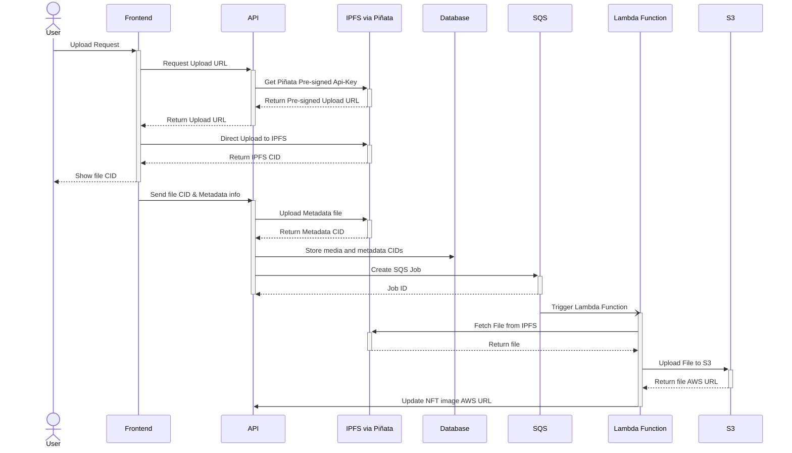

# RFC: Handle Large Media Upload

## Authors

- [bravonatalie]

## Goals

- Enable seamless uploads of large media files from the front-end.
- Reduce server memory usage.

Additionally, there's a request to change the file upload endpoint from REST to GraphQL to maintain consistency with the rest of the API.

## Background

Currently, the front-end (FE) upload component limits file sizes to a maximum of 25MB, whereas other similar platforms support files up to 100MB. This restriction prevents users from uploading high-quality media files, which is a significant issue for our use case, as NFTs can be tied to various types of media, from simple .png images to high-resolution 3D artwork and large GIFs.

The protocol is in its alpha stage, and collaborations with well-known NFT artists are being promoted on the platform via Open Editions. As of today, the team manually increased server memory to allow for large file uploads temporarily, but this approach is not sustainable.

Currently, the backend uploads files to both S3 and IPFS. Once the media file is uploaded to IPFS and assigned a CID, the NFT metadata file is also created on IPFS, and this metadata CID is used for standard NFT minting or Open Edition collection deployments. IPFS provides decentralized and immutable storage, but since it’s not optimized for fast retrieval, S3 is used to serve files to the front end, while allowing us to retain a local copy as well.

## Stakeholders

- Users of the protocol dApp (creators and collectors)
- Developers team (changes to Front-end, API, Infra and QA)
- Operations/Finance team (infrastructure costs)

## Problem

The current API architecture for handling file uploads is not suited for larger files, as the backend is forced to manage the entire file upload process, leading to high memory usage on the server. While this isn't an issue for small files, large media files place excessive strain on the server, increasing infrastructure costs and complicating scalability.

For the NFT use case, where larger files are often necessary, this bottleneck prevents users from uploading high-quality media. Not solving this issue limits market adoption and requires maintaining unnecessarily high memory resources on our servers.

### Abandoned Ideas (Optional)

- **Chunking and streaming:** Chunking the file and streaming it, which would help reduce the memory load on the server. However, this solution added complexity to the architecture.
- **Two presigned URLs:** Another idea was to generate two presigned URLs for S3 and Piñata, allowing the client to upload directly to both. This approach was discarded since it adds unnecessary duplication and delays.
- **Prioritize S3 upload:** Uploading to S3 first, then to IPFS, would cause delays in creating the NFT metadata, which is tied to the token minting/collection deployment.

## Solution

The proposed solution involves implementing direct file uploads from the client to IPFS using pre-signed URLs from Piñata. This approach shifts the burden of file transmission away from the backend, enabling users to upload large media files directly to IPFS. From the Dapp user's perspective, there will be no noticeable difference, except for the new support for larger file sizes. Users will still have the immediate option to mint tokens or deploy collections right after the file upload.

**Additional Considerations:**

- **Side Benefits:** This solution reduces server costs by allowing us to decrease memory usage, though it introduces new expenses related to Lambda and SQS services. These costs should be closely monitored to ensure they don’t outweigh the savings.
- **Verification:** We can measure the success of this approach by tracking successful large file uploads, monitoring the number of failed jobs in the SQS dead letter queue, and comparing infrastructure costs before and after implementation.

Below is an overview of the new flow. Please note that this diagram focuses only on the ideal flow and does not cover error handling or exception cases. It is simplified to ensure that even those with minimal technical knowledge can understand the process.



## Anticipated Difficulties

- Ensuring security around pre-signed URLs to prevent unauthorized use or malicious uploads.
- Increased complexity in file handling due to the additional steps and integration with multiple systems.
- Testing becomes more complex with the introduction of new steps and systems.
- Handling resumable uploads for large files in case of network interruptions could pose a challenge, as this was not initially considered.

## Risks

- It's crucial to still implement a file size limit, as allowing unlimited file sizes can pose security and performance risks.
- Any failure during the IPFS upload process could lead to delays in the NFT minting or collection deployment, potentially disrupting the user experience.
- Additional costs from using Lambda and SQS services should be carefully monitored to ensure overall cost efficiency.

## Implementation Guide

### **Back-End:**

1. Refactor the file upload module to use GraphQL.
2. Implement a new query in the file resolver `getUploadURL`:
   - Functionality:
     - Check if the collection exists and if the user is the owner.
     - Call Piñata API to generate a scoped API key (`getPinataScopedApiKey`).
3. Create a new mutation `updateFileInfo`:
   - Receive file metadata information.
   - Set metadata on IPFS through Piñata.
   - Create an SQS job to trigger a [Lambda function](https://docs.aws.amazon.com/lambda/latest/dg/example_lambda_Invoke_section.html).
   - Retry on failure and send error notifications if retries fail.
   - Update the database.

GraphQL Schema:

```graphql
type ScopedUrls {
  pinataJwt: String!
}

type UpdateFileInfoInput {
  collectionId: String!
  nftId: String!
  fileExtension: String!
  ipfsCID: String!
}

type UpdateFileInfoResponse {
  metadataCid: String
  status: FileInfoStatus!
}

type Query {
  getUploadURLs(collectionId: ID!): ScopedUrls!
}

type Mutation {
  updateFileInfo(
    updateFileInfoInput: UpdateFileInfoInput!
  ): UpdateFileInfoResponse!
}
```

### **Infrastructure:**

1. Create an SQS queue (`upload-from-ipfs-to-s3`) to handle file transfers from IPFS to S3, along with an equivalent dead-letter queue to capture and manage failed jobs.
2. Develop a Lambda function to:
   - [Consume messages from the SQS queue](https://docs.aws.amazon.com/lambda/latest/dg/with-sqs.html).
   - Fetch files from IPFS.
   - [Upload files to S3](https://docs.aws.amazon.com/AmazonS3/latest/userguide/example_s3_PutObject_section.html).
   - Call the API to update the NFT.
3. Update IAM policies to allow Lambda functions to access S3.
4. Provide an API access token to the lambda function.

### **Front-End:**

1. Modify the upload flow:
   - Request `getUploadURLs` from the backend.
   - Upload the file to piñata using the `pinFileToIPFS` endpoint on the Piñata API.
   - Call `updateFileInfo` to update file metadata on the backend.
2. Create a utility function `imageURL()` to determine whether to use `awsURL` or `ipfsURL`.
3. Map all occurrences of `ipfsUrl` and `awsUrl` usage in the FE to use `imageUrl()`.

## Rollback Plan

After successful testing on the development and testnet environments, changes can be promoted to production. The production environment is deployed via Kubernetes, which offers [rollback mechanisms](https://learnk8s.io/kubernetes-rollbacks) in case of failures. If an issue arises, the system can quickly revert to the previous stable deployment version.

## References

[Apollo Server File Upload Best Practices](https://www.apollographql.com/blog/file-upload-best-practices)

[How To Use Scoped API Keys With IPFS App Development](https://www.pinata.cloud/blog/how-to-use-scoped-api-keys-with-ipfs-app-development) (overview)

[How To Upload To IPFS From The Frontend With Signed JWTs](https://medium.com/pinata/how-to-upload-to-ipfs-from-the-frontend-with-signed-jwts-3b19d3078580) (example)
